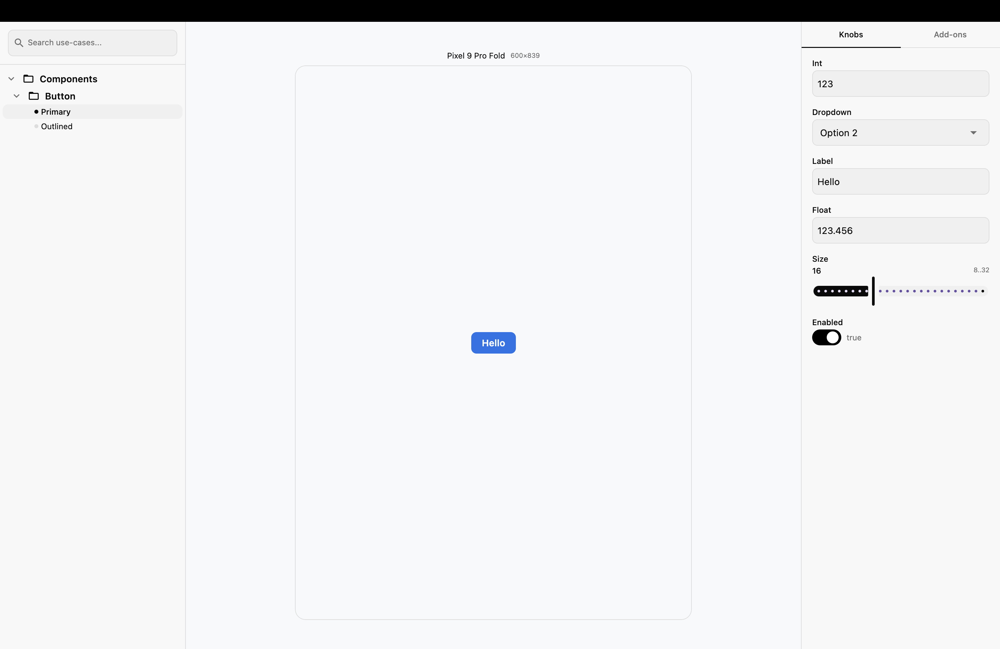
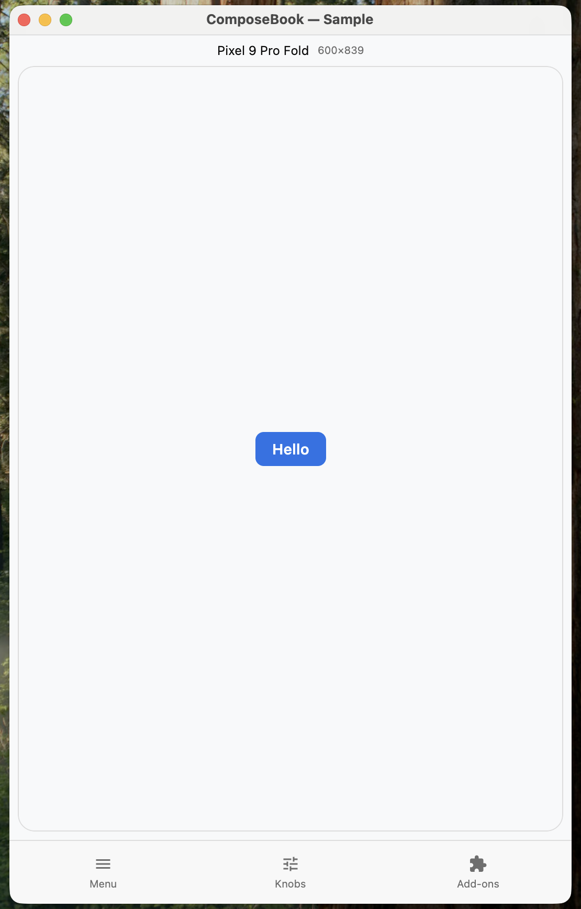
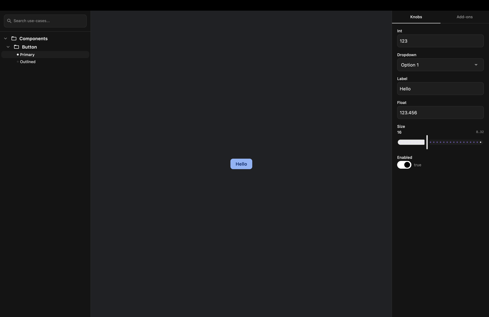
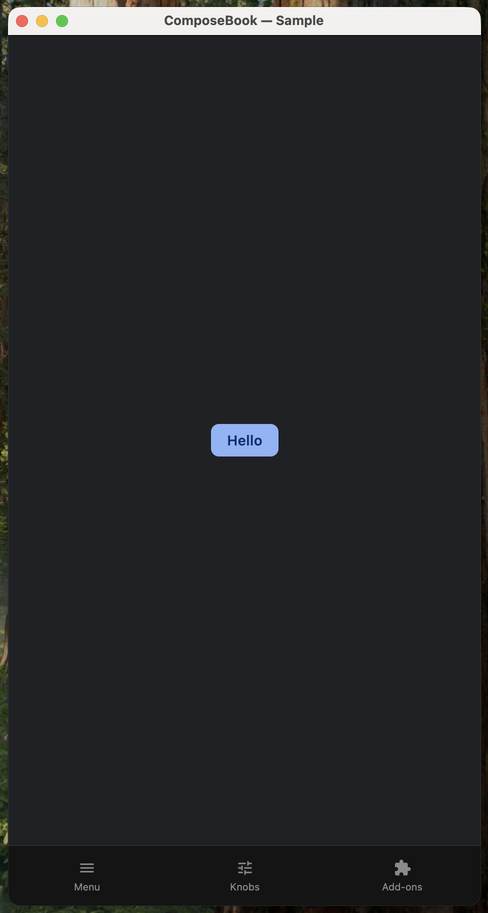

# ComposeBook

 Desktop Preview                                   |                 Mobile Preview                  |
|:--------------------------------------------------|:-----------------------------------------------:|
|  |  |
|   |   |

A Storybook-like UI component browser for **Compose Multiplatform**. Showcase, test, and interact
with your composable components in isolation across Android, iOS, Desktop, and Web.

## Features

- **Component Isolation** - Preview UI components independently with use cases organized in
  directories
- **Dynamic Knobs** - Real-time property controls (string, boolean, int slider) to tweak component
  parameters on the fly
- **Addon System** - Extensible plugins for theme switching, device viewport previews, and text
  scaling
- **Responsive Shell** - Automatically adapts between a 3-column desktop layout and a bottom-sheet
  mobile layout
- **Multi-Platform** - Runs on Android, iOS, Desktop (JVM), and Web (WASM)
- **Search** - Full-text search across all registered use cases

## Supported Platforms

| Platform | Status                |
|----------|-----------------------|
| Android  | Min SDK 24            |
| iOS      | x64, arm64, simulator |
| Desktop  | JVM 17+               |
| Web      | WASM (Browser)        |

## Installation

1. Add this to your settings.gradle.kts or project `build.gradle.kts`:

```gradle
repositories {
  maven { url = uri("https://jitpack.io") }
}
```

2. Add the dependency

```gradle
dependencies {
    implementation("com.github.thisisyusub:compose-book:0.1.2")
}
```
```

## Quick Start

### Basic Setup

```kotlin
@Composable
fun MyComposeBook() {
    ComposeBook(
        composeBookConfig {
            directory("Components") {
                directory("Button") {
                    useCase("Primary") {
                        MyButton(label = knob.string("Label", "Click Me"))
                    }
                    useCase("Outlined") {
                        MyButton(label = knob.string("Label", "Cancel"))
                    }
                }
            }
        }
    )
}
```

### Using Knobs

Knobs let you dynamically control component properties from the side panel:

```kotlin
useCase("Example") {
    val label = knob.string("Label", "Hello")
    val enabled = knob.boolean("Enabled", true)
    val size = knob.intSlider("Size", initialValue = 16, range = 8..32)

    MyComponent(label = label, enabled = enabled, size = size)
}
```

### Adding Addons

Addons extend the preview environment with theme switching, viewport simulation, and text scaling:

```kotlin
ComposeBook(
    composeBookConfig {
        addons {
            themeAddon(
                themes = listOf(
                    ThemeOption("Light", lightTheme),
                    ThemeOption("Dark", darkTheme),
                ),
                builder = { config, content ->
                    MyThemeProvider(theme = config) {
                        content()
                    }
                },
            )
            viewportAddon()    // Device viewport preview
            textScaleAddon()   // Font scale control
        }

        directory("Components") {
            // ...
        }
    }
)
```

### Organizing Use Cases

Use extension functions on `DirectoryBuilder` to keep your configuration modular:

```kotlin
fun DirectoryBuilder.buttonUseCases() {
    directory("Button") {
        useCase("Primary") {
            AppButton(label = knob.string("Label", "Click Me"))
        }
        useCase("Outlined") {
            AppButton(label = knob.string("Label", "Cancel"))
        }
    }
}

// Then reference in config:
composeBookConfig {
    directory("Components") {
        buttonUseCases()
    }
}
```

## Built-in Addons

| Addon              | Description                                                                         |
|--------------------|-------------------------------------------------------------------------------------|
| `themeAddon()`     | Switch between multiple theme configurations                                        |
| `viewportAddon()`  | Preview components in various device frames (Pixel, iPhone, iPad, Samsung, Desktop) |
| `textScaleAddon()` | Adjust font scaling to test accessibility                                           |

## Built-in Knob Types

| Knob               | Description          |
|--------------------|----------------------|
| `knob.string()`    | Text input field     |
| `knob.boolean()`   | Toggle switch        |
| `knob.intSlider()` | Numeric range slider |
| `knob.int()`       | Integer input field  |
| `knob.float()`     | Float input field    |
| `knob.dropdown()`  | Dropdown field       |

## Architecture

```
composebook/
├── ComposeBook.kt                # Main entry point composable
├── core/
│   ├── models/                   # UseCase, Directory, NavigationPath
│   ├── knobs/                    # Knob system (BooleanKnob, StringKnob, IntSliderKnob)
│   ├── addons/                   # Addon plugin interface + defaults
│   └── navigation/               # Navigation state and search
├── dsl/                          # Type-safe builder DSL
└── ui/                           # Desktop and mobile shell layouts
```

## Running the Sample App

The `sample/` module contains a full demo app with custom themes and component examples.

```bash
# Desktop
./gradlew :sample:run

# Android
./gradlew :sample:installDebug

# Web (WASM)
./gradlew :sample:wasmJsBrowserRun
```